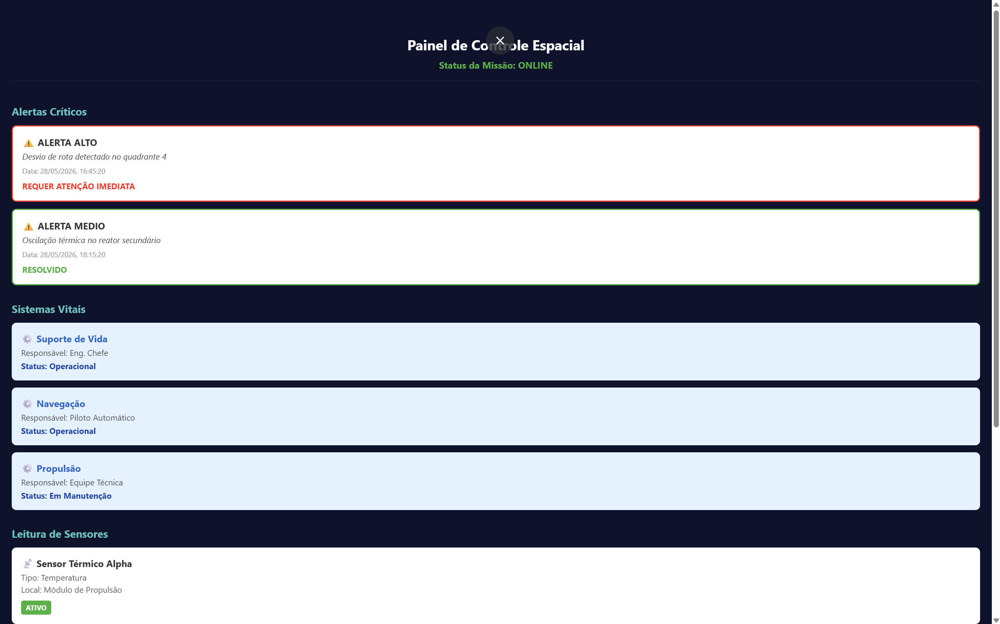

# GLOBAL SOLUCTION - Controle de Missão Espacial - Solução Integrada

Projeto desenvolvido para a disciplina de **Advanced Programming And Mobile Dev** (FIAP).

## 👥 Integrantes
- [Mário Secundino Santana Lopes Portella] - RM: [555321]
- [Luis Fernando Picarelli Gonçalves Guariglia] - RM: [555458]

## 🚀 Sobre o Projeto
Solução integrada para controle de missão espacial (Simulada), composta por um backend em Java (Spring Boot) e um aplicativo mobile em React Native com TypeScript, utilizando persistência H2.

## 🛠️ Tecnologias
- **Backend:** Java 17, Spring Boot, Spring Data JPA, H2 Database, Lombok.
- **Frontend:** React Native, Expo, TypeScript, Axios.

## 💻 Como Rodar

### Backend
1. Navegue até a pasta `backend`(cd backend).
2. Execute a aplicação Spring Boot (Rodar arquivo GlobalSoluction1BackendApplication.java que pode ser achado por esse caminho: GS-Mobile\backend\src\main\java\com\fiap\ec\).
3. A API estará disponível em `http://localhost:8080`.

### Frontend
1. Navegue até a pasta `frontend`(cd frontend).
2. Instale as dependências: `npm install`.
3. Inicie o projeto: `npx expo start`.
4. Pressione `w` para abrir no navegador ou utilize o app Expo Go.

### Exemplo do Sistema Funcionando
